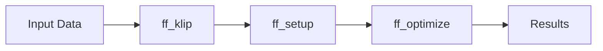

# ffortissimo

**ffortissimo** is a Python package for fitting pixel-by-pixel freeform models to KLIP-reduced astronomical images of extended objects, with a focus on circumstellar disk observations in scattered light.

## Overview

ffortissimo provides a flexible framework for forward modeling extended astronomical sources (primarily disks in scattered light) in high-contrast imaging data. The package leverages JAX for efficient gradient-based optimization and integrates with the KLIP (Karhunen-Loève Image Projection) pipeline for PSF subtraction.

### Key Features

- **Pixel-by-pixel freeform modeling** of extended sources in single-filter high-contrast imaging data
- **JAX-based optimization** for efficient gradient computation and optimization
- **KLIP integration** with forward modeling for accurate PSF subtraction
- **Support for ADI and RDI modes** (Angular Differential Imaging and Reference Differential Imaging)
- **Simple regularization** facilitated by spatial frequency penalties via a single parameter

## Installation

### Requirements

- Python >= 3.11
- numpy >= 2.1
- jax >= 0.4.0
- jaxlib >= 0.4.0
- astropy >= 5.0.0
- scipy >= 1.7.0
- matplotlib >= 3.5.0
- pyyaml >= 6.0
- emcee >= 3.1.0
- numba >= 0.56.0
- optax >= 0.1.0
- pandas >= 2.3.3
- opencv-python >= 4.11.0
- h5py >= 3.14.0
- bottleneck >= 1.5.0

### Installation

**From GitHub (recommended for public use):**

```bash
pip install git+https://github.com/<username>/debrisdisk_freeform_fit_and_plot.git
```

**From clone (development):**

```bash
git clone https://github.com/<username>/debrisdisk_freeform_fit_and_plot.git
cd debrisdisk_freeform_fit_and_plot

# Install in development mode
pip install -e .

# Or install with development dependencies
pip install -e ".[dev]"
```

After installation, the CLI commands `ff_klip`, `ff_setup`, and `ff_optimize` are available.

## Quick Start

The pipeline has three discrete steps. Run them in order:



### 1. Prepare Configuration File

Create or use an existing YAML configuration file in `initialization_files/`. See existing examples (e.g., `HR4796_RDI_i_20240328_29.yaml`, `HR4796_g_camsci1_20250408_09.yaml`).

### 2. Step 1: Run KLIP Reduction (`ff_klip`)

```bash
ff_klip -p initialization_files/your_config.yaml
```

Or, for development without install: `python -m ffortissimo.ff_klip -p initialization_files/your_config.yaml`

**Optional flags:** `--force` (regenerate existing basis), `--log-to-file`, `--make-diskless-image`

This step:
- Loads and prepares the dataset
- Runs KLIP reduction with forward modeling
- Generates KLIP basis file (`*_klbasis.h5`)
- Saves the KLIP-reduced image to FITS

### 3. Step 2: Create Masks and Noise Map (`ff_setup`)

```bash
ff_setup -p initialization_files/your_config.yaml
```

**Optional flags:** `--initial-model`, `--do-fm` (forward-modeling dry run), `--injected-dir`, `--log-to-file`

This step:
- Verifies that `ff_klip` was run successfully
- Creates binary masks for disk generation and noise mapping
- Estimates spatial noise map from masked reduced data
- Optionally performs a forward-modeling dry run with `--do-fm`

### 4. Step 3: Fit Freeform Model (`ff_optimize`)

```bash
ff_optimize -p initialization_files/your_config.yaml -i 50000
```

Use `--dry-run` to perform a single forward-modeling pass without optimization (no `-i` needed).

**Optional flags:** `-i`/`--iterations` (required for optimization), `--loss-tolerance`, `--initial-model`, `--reg`, `--learning-rate`, `--injected-dir`, `--log-to-file`

This performs the JAX-based freeform model optimization. Early stopping may occur based on `--loss-tolerance`.

### 5. (Optional) Fit Physical Model

```bash
python scripts/modelfit_physical_to_freeform.py -p initialization_files/your_config.yaml
```

Fit a physics-informed parametric disk model to the freeform results using MCMC.

### Fake Disk Injection (Test Utility)

`inject_fake_disk` is an auxiliary tool for validation and testing. It injects a synthetic disk with known parameters into real FITS images to create a controlled test dataset. You can then run the full pipeline to recover the known disk and validate the method.

**Workflow:**
1. Run `inject_fake_disk` to create synthetic data:
   ```bash
   inject_fake_disk -p initialization_files/your_config.yaml -o synthetic_output_dir
   ```
2. Run the pipeline with `--injected-dir`:
   ```bash
   ff_klip -p initialization_files/your_config.yaml --injected-dir synthetic_output_dir
   ff_setup -p initialization_files/your_config.yaml --injected-dir synthetic_output_dir
   ff_optimize -p initialization_files/your_config.yaml -i 10000 --injected-dir synthetic_output_dir
   ```

**Options:** `--pa`, `--rad`, `--hires`, `--data-dir` — see the [`inject_fake_disk.py`](src/ffortissimo/inject_fake_disk.py) module for details.

## Project Structure

```
debrisdisk_freeform_fit_and_plot/
├── src/
│   └── ffortissimo/          # Main package
│       ├── ff_klip.py               # Step 1: KLIP reduction
│       ├── ff_setup.py              # Step 2: Masks and noise map
│       ├── ff_optimize.py           # Step 3: Freeform optimization
│       ├── inject_fake_disk.py      # Auxiliary: synthetic disk injection
│       ├── diskfit_freeform.py      # Legacy / internal use
│       ├── modeling/                # Disk model classes
│       ├── io/                      # I/O and file handling
│       ├── utils/                   # Utility functions
│       └── dev/pyklip/              # Modified pyklip package
├── scripts/                   # Analysis scripts (e.g., modelfit_physical_to_freeform)
├── initialization_files/      # YAML configs (e.g., HR4796_RDI_i_20240328_29.yaml)
├── starting_models/           # Initial model FITS files
└── tests/                     # Test scripts
```

## Configuration

The pipeline is configured via YAML files in `initialization_files/`. Key configuration sections include:

- **Data paths**: Directories for input data, KLIP outputs, and results
- **Mask parameters**: Inner/outer working angles, optimization regions
- **KLIP settings**: Number of KL modes, annuli, subsections
- **Optimization parameters**: Learning rate, regularization strength, iteration count
- **Instrument settings**: PSF information, pixel scales, centers

See `initialization_files/HR4796_RDI_i_20240328_29.yaml` or `initialization_files/HR4796_g_camsci1_20250408_09.yaml` for detailed examples.

## Usage Examples

### Basic Pipeline (CLI)

```bash
ff_klip -p initialization_files/your_config.yaml
ff_setup -p initialization_files/your_config.yaml
ff_optimize -p initialization_files/your_config.yaml -i 50000
```

### Custom Optimization Settings

```bash
ff_optimize -p initialization_files/your_config.yaml \
    -i 100000 \
    --reg 0.5 \
    --learning-rate 0.005
```

## Output Files

The pipeline generates several output files:

- **Freeform model FITS files**: Best-fit freeform disk model
- **Forward modeled images**: PSF-subtracted images using the freeform model
- **Optimization history**: Loss values and convergence metrics
- **Visualization plots**: Comparison plots showing data, model, and residuals

Outputs are saved in the directory specified by `resultsdir` in the configuration file.

## Citation

A paper describing FFortissiMo is currently in review. Once published, we ask that you cite:

*[Placeholder: paper citation will be added upon publication]*

For now, you may cite the software:

```bibtex
@software{ffortissimo2026,
  author = {Kueny, Jay},
  title = {ffortissimo: Pixel-based Freeform Forward Modeling},
  year = {2026},
  version = {0.1.0}
}
```

## Contributing

Contributions are welcome! Please feel free to submit issues or pull requests.

## License

MIT License - see LICENSE file for details.

## Contact

- **Author**: Jay Kueny
- **Email**: jkueny@arizona.edu
- **Institution**: University of Arizona

## Acknowledgments

This package builds upon and extends functionality from:
- [pyKLIP](https://bitbucket.org/pyKLIP/pyklip) for KLIP reduction
- JAX for automatic differentiation and optimization
- The high-contrast imaging community for methods and inspiration
